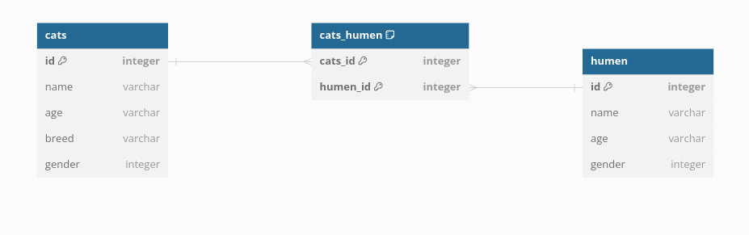

# Humans And Cats Join Table Example

## Introduction
This repo is a Ruby on Rails project that shows how and why you should use join tables. This is part of a video lesson that is recorded here:

TODO: add youtube link

## What are join tables and what are their purpose?

Join tables allow us to create a polymorphic association that encapsulates the idea of a "many to many" relationship.

**Note: If you do not know what a polymorphic association is**
I really like this definition of a polymorphic association from this medium article: [https://patrickkarsh.medium.com/polymorphic-associations-database-design-basics-17faf2eb313](https://patrickkarsh.medium.com/polymorphic-associations-database-design-basics-17faf2eb313)
<blockquote>

At its core, a polymorphic association is a database design concept that allows a single database field to be associated with multiple types of records. In other words, it permits a single column to act as a bridge between multiple tables, enabling a record in one table to be linked to records in multiple other tables.
</blockquote>

The main reason to use join tables to represent many to many assocations, is because without join tables it makes it harder and less efficient to make queries with tables that has this many to many relationship.

### How are they implemented in SQL

A Join Table is a table who only has 2 fields. These 2 fields are foreign key fields, so each field will hold the primary key of another table.

## What is a many to many relationship?

A many-to-many relationship occurs when your data has two tables where each record of the first table can be associated with many other records from another table and vice versa. Do NOT get confused with a 1-to-many relationship; the core difference here is that many records are associated with many other records.

### Many to Many relationship real life example

Let's say you are making an app that keeps track of how many human companions a cat has, or vice versa, how many cats a human owns.

Technically, in the real world, the owners of a cat can be multiple; for example, if a household has a mom, a dad, and two college-age kids, and that household has multiple cats, there's a many-to-many relationship there.

Many humans can own many cats and many cats can be owned by many humans

## Representing many to many using join tables

This is a diagram of the relationship we want to represent:



### Rails Migration

A join table only needs to have 2 fields, a foreign key field 1 table and a foreign key field from another table.

Ruby on Rails has a built in migration method to generate this table.

```ruby
create_join_table :first_table_name, :second_table_name
```

A concrete example from this repo:

```ruby
# db/migrate/20231223034301_create_join_table_humen_cats.rb
class CreateJoinTableHumenCats < ActiveRecord::Migration[7.1]
  def change
    create_join_table :humen, :cats do |t|
      # From the docs: https://api.rubyonrails.org/v7.1.2/classes/ActiveRecord/Associations/ClassMethods.html#method-i-has_and_belongs_to_many
      # It’s also a good idea to add indexes to each of those columns to speed up the joins process. However, in MySQL it is advised to add a compound index for both of the columns as MySQL only uses one index per table during the lookup.
      t.index [:human_id, :cat_id]
      t.index [:cat_id, :human_id]
    end
  end
end
```
### Active Record Associations

Creating the migration is not enough, ideally you would want to create ActiveRecord associations on your models so you can use the helper methods built in.

Here is an example:

```ruby
class Human < ApplicationRecord
  # by adding this association you are able to call cats as a collection
  has_and_belongs_to_many :cats
end

# this returns an array of cat objects
Human.first.cats

# make sure you add the association to the other model
class Cat < ApplicationRecord
  has_and_belongs_to_many :humen
end


# this returns an array of human objects
Cat.first.humen
```

By having this association it gives you a lot of utility methods as mentioned in the docs here:
https://api.rubyonrails.org/v7.1.2/classes/ActiveRecord/Associations/ClassMethods.html#method-i-has_and_belongs_to_many

The utility method we are using in this repo is this one:
```txt
collection_singular_ids=ids
    Replace the collection by the objects identified by the primary keys in ids.
```

We are using it implicitly in our `app/controllers/cat_controllers` by extracting it from params and using it as keyword arguments to save/update.


